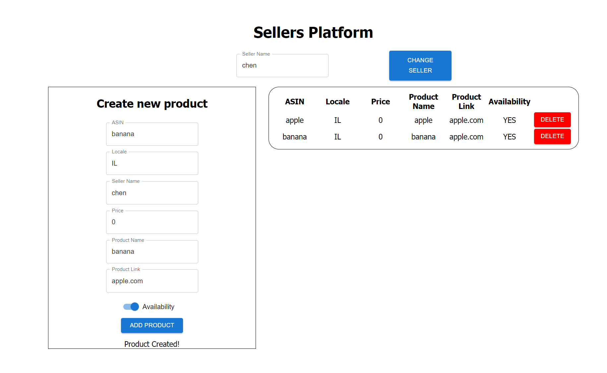

 # Roundforest mid-level fullstack task

 

## Using BFF (Backend for front-end) & Next.JS + webpack
## Style by Material-UI

## Requirements

- MongoDB Server running on localhost (With db name called: 'amazon_db' and collection name: 'seller_products')
- Node.JS v18.16+
- Most of the packages in the package.json
- Postman JSON file is provided with example for endpoints requests

## How To Run

npm run test
node server

## Configuration

All configuration can be found in server.js
Other server.config.[env].js files are for environments and will not be used(we will run this task locally only).
